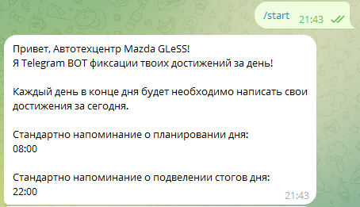
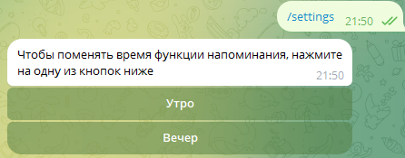
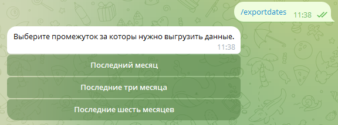

<h1>Телеграмм бот для планирования и подведения итогов для</h1>

Телеграмм бот @PersonalJornalBot призван привести ваши планы к реализации. Планирование для и подведение его итогов это всё для чего придуман данный бот.

<h3>Команды:</h3>
<h4>/start</h4>

<h4>/settings</h4>

<h4>/expoerdates</h4>

<h3>Запуск</h3>
1. Для запуска необходимо установить зависимости в файле requirements.txt при помощи команды: 
<h4>pip install -r requirements.txt</h4>
2. Создать файл 
<h4>.env</h4>
в котором надо установить значение переменной 
<h4>BOTKEY = 'token for bot'</h4>
Этот токен можо получить при создании телеграмм бота в
<h4>@BotFather</h4>